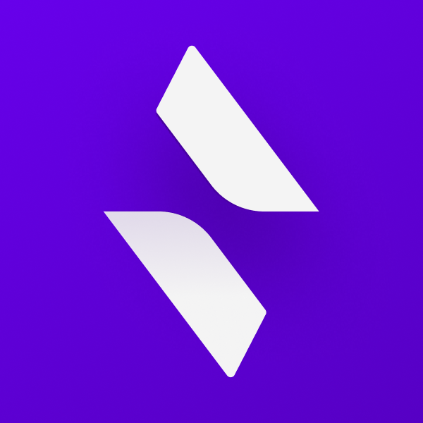

# Blitz Community Bot

_A utility bot built for the [Blitz Community Discord Server](https://discord.gg/blitzjs)._

# Contributing

See the [documentation](https://cookiecord.js.org/) for the framework we use.

We also have a docker-compose.yml for development, along with a .env.example.

**This adds a fancy help channel system where users can claim a channel until their issue is resolved.** Once resolved, that help channel goes dormant until it get's cycled back into the open channels. Make sure you truly need this as it will likely inconvenience your members rather than benefit them. We used a static channel system (like #help-1 and #help-2) until we started to see issues arising (many questions being asked on top of eachother without answers).

## Thanks!

-   [ronthecookie](https://github.com/ronthecookie) for writing the base for the bot and the amazing [framework](https://github.com/cookiecord/cookiecord) used!
-   [Typescript Discord](https://github.com/typescript-community/community-bot) bot which we forked as the basis of this.
